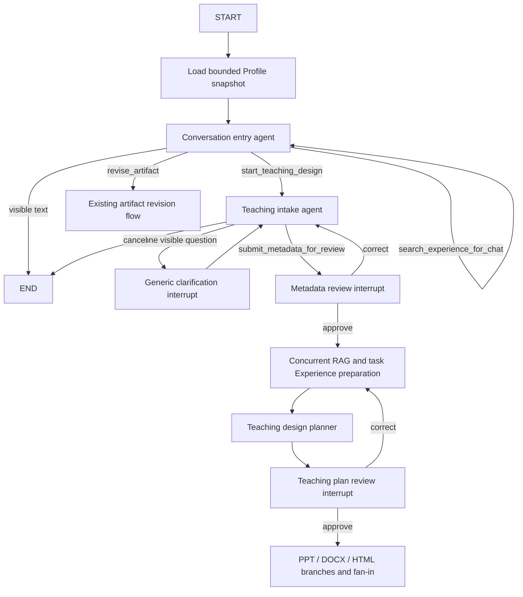

# Main LangGraph conversation orchestration

The default main graph uses two tool-capable model roles instead of separate intent, normal-chat, metadata-extraction, completeness, and follow-up model nodes.

The entry model must produce exactly one outcome: ordinary visible text, a teaching-design action, or an artifact-revision action. An optional read-only Experience search is allowed for ordinary teaching discussion and remains scoped to that turn. Internal action arguments are validated locally and never become conversation text or SSE tokens.

Teaching intake evaluates a bounded transcript for the active teaching task. It keeps the initial request, clarification turns, explicit corrections, and deduplicated attachment summaries. Earlier tasks, tool protocol, RAG chunks, and memory bodies are excluded. Incomplete turns store only the visible question; no partial `teaching_metadata` object is persisted. A canonical metadata snapshot is created only after a valid `submit_metadata_for_review` action, with backend-owned `is_complete=true`.

Clarification, metadata review, and teaching-plan review remain separate durable interrupt nodes. Model work finishes before entering each interrupt, so checkpoint resume does not replay that work. Clarification waits for free text and does not create an approval card. The two review stages retain the existing `metadata_review` and `teaching_plan_review` approval payloads and stale-interrupt validation.

SSE continues to use `metadata`, `token`, `progress`, `artifact`, `artifact_trace`, `approval`, `suggestions`, `error`, and `done`. Only validated, committed visible text is emitted as `token`; tool calls, partial arguments, mixed preambles, and empty messages are suppressed. Stable progress keys are unchanged, so existing UI cards and replay behavior remain compatible.

Memory keeps three distinct lifecycles:

- Profile is loaded once at graph entry and is bounded background context. Intake cannot infer missing task facts from it.
- Ordinary-chat Experience is an optional, bounded, authenticated lookup for one turn and is not promoted into task state.
- Teaching-task Experience is resolved only after metadata approval. It runs concurrently with RAG, is checkpointed by a retrieval-significant scope key, and is reused by planning, approval resume, and artifact fan-out. A material approved correction changes the key and causes one refresh. Optional RAG and Experience failures degrade independently and fail open.

## Runtime topology

Only the topology shown above is registered at runtime. The retired intent, normal-chat, metadata-extraction, and follow-up nodes are not compiled as compatibility aliases, and there is no environment switch back to the retired graph. Checkpoints whose pending node names belong to that retired topology are not resumable by this version.

The bounded intake limits are controlled by `TEACHING_INTAKE_CONTEXT_MAX_CHARS` (default `12000`) and `TEACHING_INTAKE_MAX_TURNS` (default `8`).
